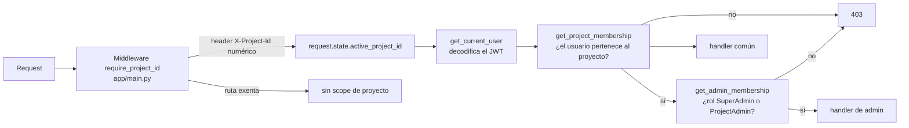
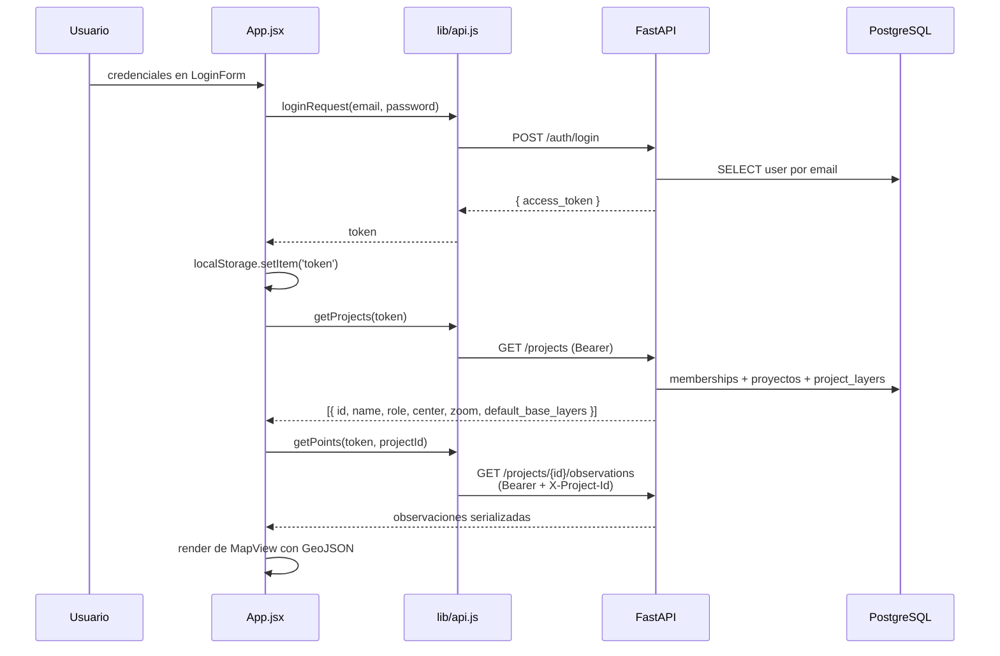
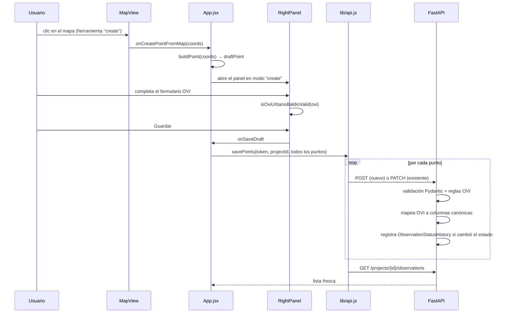
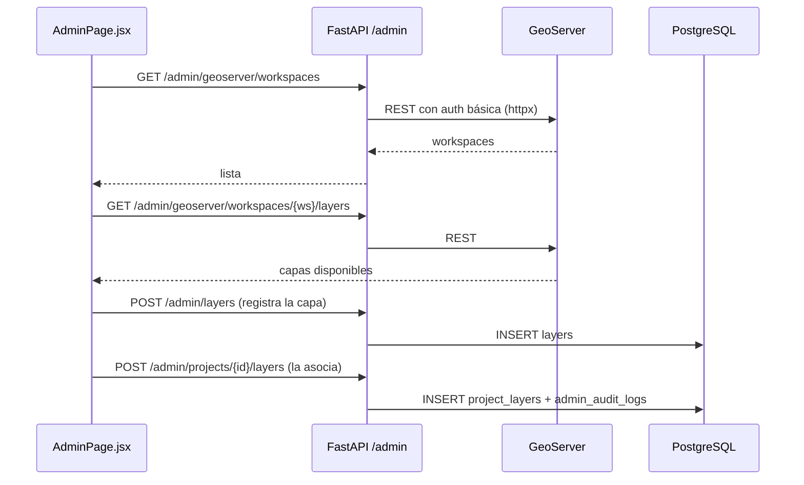

# Flujos de request

## Cadena de autorización

Toda ruta protegida atraviesa la misma cadena. Entenderla evita el 90 % de los
403 inesperados.

Las dependencias viven en `app/api/deps.py`. Las rutas exentas del header están
listadas en `PROJECT_ID_EXEMPT_PATHS` (`app/main.py`): `/auth/login`,
`/projects`, `/health`, `/docs`, `/openapi.json` y `/redoc`. Cualquier otra
ruta sin `X-Project-Id` responde **400**, no 401 ni 403.

## Arranque del visor

`GET /projects` devuelve, además del rol del usuario en cada proyecto, las
capas de GeoServer asociadas con sus overrides ya resueltos (`available`,
`default_visible`, `z_index`). `MapView.jsx` filtra las de tipo `WMS` y arma
para cada una una fuente raster contra
`${VITE_GEOSERVER_URL}/{workspace}/wms`.

El rol también decide la UI: `App.jsx` habilita la ruta `/admin` sólo si el
usuario tiene `SuperAdmin` o `ProjectAdmin` en algún proyecto.

## Alta y edición de observaciones

Tres comportamientos que conviene tener presentes antes de tocar este flujo:

1. **`savePoints` reenvía todos los puntos, no sólo el editado.** `App.persist`
   le pasa el arreglo completo y `savePoints` itera sobre él emitiendo un
   request por punto. Guardar una observación en un proyecto con N puntos
   genera N requests más un refetch. Es el mayor candidato a optimización del
   frontend.
2. **`persisted` decide el verbo HTTP.** Los puntos nuevos nacen con
   `persisted: false` (POST) y el refetch los devuelve con `persisted: true`
   (PATCH). Si ese flag se pierde, se crean duplicados.
3. **El id lo asigna el cliente en el borrador y el servidor en la
   persistencia.** `buildPoint` usa `crypto.randomUUID()`, pero el UUID que
   queda es el que genera el backend; por eso, después de crear, `App.jsx`
   reselecciona a partir de la lista devuelta.

### Del payload OVI a las columnas canónicas

Cuando el payload trae `ovi_urbano_baldio`, `app/api/routes/observations.py`
ignora los campos sueltos equivalentes y deriva las columnas canónicas desde el
bloque OVI:

| Campo OVI | Columna en `observations` |
| --- | --- |
| `VALOR_TOTAL` | `market_value_total` |
| `FECHA_VALOR` | `valuation_date` |
| `SUPERFICIE` | `surface_total` |
| — | `surface_unit` se fuerza a `"m2"` |
| `MONEDA` (0/1) | `currency_id` vía catálogo (`0 → ARS`, `1 → USD`) |

El detalle completo queda además en la tabla
`observation_ovi_urbano_baldio`. Duplicar el dato es intencional: las columnas
canónicas sirven para consultas transversales a todos los tipos de inmueble, y
la tabla de detalle preserva el registro fiel al diccionario OVI.

## Administración de capas

El backend nunca escribe en GeoServer desde `app/`: los endpoints
`/admin/geoserver/*` son de sólo lectura y sirven para que el panel ofrezca
workspaces, capas y estilos existentes. Publicar capas nuevas en GeoServer es
tarea del servicio legacy `backend/app/geoserver.py` o de la consola de
GeoServer.

Cada mutación del panel de administración deja registro en `admin_audit_logs`
mediante el helper `_audit` de `app/api/routes/admin.py`. Un endpoint de admin
nuevo que no llame a `_audit` rompe esa garantía.
