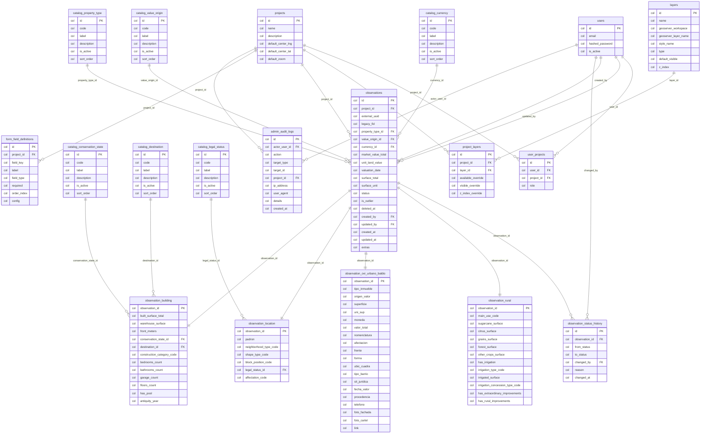

<!-- GENERADO POR scripts/build_repo_graph.py — NO EDITAR A MANO -->

# Modelo de datos

Entidades derivadas de los modelos SQLAlchemy en `app/models/`.
Las relaciones son claves foráneas declaradas en el código.

## Tablas

| Tabla | Modelo | Archivo | Columnas |
| --- | --- | --- | --- |
| `admin_audit_logs` | `AdminAuditLog` | `app/models/admin.py` | 10 |
| `catalog_conservation_state` | `CatalogConservationState` | `app/models/catalogs.py` | 6 |
| `catalog_currency` | `CatalogCurrency` | `app/models/catalogs.py` | 6 |
| `catalog_destination` | `CatalogDestination` | `app/models/catalogs.py` | 6 |
| `catalog_legal_status` | `CatalogLegalStatus` | `app/models/catalogs.py` | 6 |
| `catalog_property_type` | `CatalogPropertyType` | `app/models/catalogs.py` | 6 |
| `catalog_value_origin` | `CatalogValueOrigin` | `app/models/catalogs.py` | 6 |
| `form_field_definitions` | `FormFieldDefinition` | `app/models/admin.py` | 8 |
| `layers` | `Layer` | `app/models/admin.py` | 8 |
| `observation_building` | `ObservationBuilding` | `app/models/observation.py` | 13 |
| `observation_location` | `ObservationLocation` | `app/models/observation.py` | 7 |
| `observation_ovi_urbano_baldio` | `ObservationOviUrbanoBaldio` | `app/models/observation.py` | 20 |
| `observation_rural` | `ObservationRural` | `app/models/observation.py` | 13 |
| `observation_status_history` | `ObservationStatusHistory` | `app/models/observation.py` | 7 |
| `observations` | `Observation` | `app/models/observation.py` | 20 |
| `project_layers` | `ProjectLayer` | `app/models/admin.py` | 6 |
| `projects` | `Project` | `app/models/project.py` | 6 |
| `user_projects` | `UserProject` | `app/models/user_project.py` | 4 |
| `users` | `User` | `app/models/user.py` | 4 |
