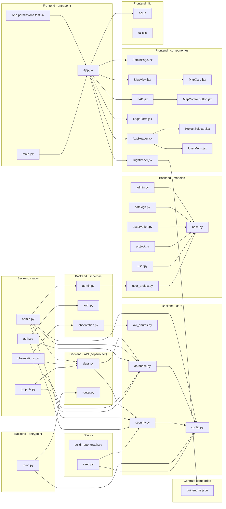

<!-- GENERADO POR scripts/build_repo_graph.py — NO EDITAR A MANO -->

# Grafo de módulos

Aristas = imports reales extraídos del código fuente.
Se omiten tests, migraciones y `__init__.py` para que el diagrama sea legible.

## Archivos por capa

### Backend · entrypoint

- `app/main.py` — 39 líneas

### Backend · API (deps/router)

- `app/api/__init__.py` — 1 líneas
- `app/api/deps.py` — 63 líneas
- `app/api/router.py` — 10 líneas

### Backend · rutas

- `app/api/routes/__init__.py` — 4 líneas
- `app/api/routes/admin.py` — 855 líneas
- `app/api/routes/auth.py` — 35 líneas
- `app/api/routes/observations.py` — 487 líneas
- `app/api/routes/projects.py` — 92 líneas

### Backend · core

- `app/core/__init__.py` — 1 líneas
- `app/core/config.py` — 19 líneas
- `app/core/database.py` — 18 líneas
- `app/core/ovi_enums.py` — 20 líneas
- `app/core/security.py` — 33 líneas

### Backend · modelos

- `app/models/__init__.py` — 49 líneas
- `app/models/admin.py` — 85 líneas
- `app/models/base.py` — 6 líneas
- `app/models/catalogs.py` — 71 líneas
- `app/models/observation.py` — 242 líneas
- `app/models/project.py` — 22 líneas
- `app/models/user.py` — 16 líneas
- `app/models/user_project.py` — 36 líneas

### Backend · schemas

- `app/schemas/__init__.py` — 43 líneas
- `app/schemas/admin.py` — 122 líneas
- `app/schemas/auth.py` — 23 líneas
- `app/schemas/observation.py` — 241 líneas

### Frontend · entrypoint

- `src/App.jsx` — 349 líneas
- `src/App.permissions.test.jsx` — 201 líneas
- `src/main.jsx` — 11 líneas

### Frontend · componentes

- `src/components/AdminPage.jsx` — 1248 líneas
- `src/components/AppHeader.jsx` — 27 líneas
- `src/components/FAB.jsx` — 85 líneas
- `src/components/LoginForm.jsx` — 63 líneas
- `src/components/MapCard.jsx` — 9 líneas
- `src/components/MapControlButton.jsx` — 17 líneas
- `src/components/MapView.jsx` — 424 líneas
- `src/components/ProjectSelector.jsx` — 15 líneas
- `src/components/RightPanel.jsx` — 378 líneas
- `src/components/UserMenu.jsx` — 52 líneas

### Frontend · UI kit

- `src/components/ui/accordion.jsx` — 43 líneas
- `src/components/ui/button.jsx` — 37 líneas
- `src/components/ui/card.jsx` — 40 líneas
- `src/components/ui/input.jsx` — 21 líneas
- `src/components/ui/select.jsx` — 20 líneas
- `src/components/ui/table.jsx` — 39 líneas

### Frontend · lib

- `src/lib/api.js` — 318 líneas
- `src/lib/utils.js` — 7 líneas

### Frontend · estilos

- `src/styles/app.css` — 1122 líneas
- `src/styles/maplibre-controls.css` — 43 líneas

### Contrato compartido

- `shared/ovi_enums.json` — 58 líneas

### Migraciones (Alembic)

- `alembic/env.py` — 49 líneas
- `alembic/versions/20260218_0002_ovi_phase1_core.py` — 237 líneas
- `alembic/versions/20260218_0003_ovi_phase2_details.py` — 82 líneas
- `alembic/versions/20260219_0004_admin_backend.py` — 101 líneas
- `alembic/versions/20260219_0005_layer_style_name.py` — 26 líneas
- `alembic/versions/20260219_0006_project_layer_available.py` — 26 líneas
- `alembic/versions/20260219_0007_ovi_urbano_baldio.py` — 50 líneas
- `alembic/versions/20261018_0001_initial_auth_projects.py` — 69 líneas

### Servicio GeoServer (legacy)

- `backend/app/db.py` — 32 líneas
- `backend/app/geoserver.py` — 130 líneas
- `backend/app/main.py` — 201 líneas

### Scripts

- `scripts/__init__.py` — 1 líneas
- `scripts/build_repo_graph.py` — 727 líneas
- `scripts/seed.py` — 128 líneas

### Tests

- `tests/conftest.py` — 66 líneas
- `tests/test_admin_permissions.py` — 177 líneas
- `tests/test_auth_and_isolation.py` — 100 líneas
- `tests/test_bulk_csv.py` — 49 líneas
- `tests/test_exporter.py` — 105 líneas
- `tests/test_observation_schema.py` — 173 líneas

### Raíz

- `app/__init__.py` — 1 líneas
- `bulk_csv_app.py` — 194 líneas
- `exporter.py` — 323 líneas
- `postcss.config.js` — 7 líneas
- `tailwind.config.js` — 41 líneas
- `vite.config.js` — 11 líneas
